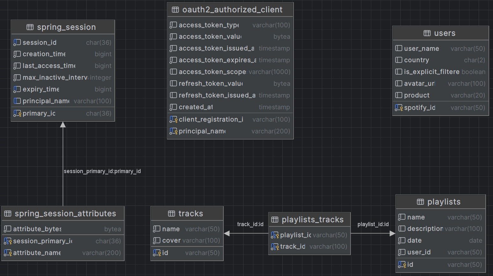

# SoundStats
Сервис для просмотра статистики Spotify и создания плейлистов  
https://alexmoroz-web.onrender.com/

## Возможности

- Просмотр текущего мирового рейтинга треков
- Просмотр статистики треков и исполнителей по аккаунту авторизованного пользователя
- Создание плейлистов на аккаунт авторизованного пользователя

## Используемые технологии

На фронтенде используется связка Thymeleaf+CSS, вызовы к API выполняются через JS. Для сборки стилей (нотация БЭМ) используется SCSS
Бэкенд написан на языке Kotlin, в качестве фреймворка выбран Spring Boot. За доступ к данным отвечает Spring JPA
Аутентификация и авторизация пользователей производится через их аккаунт Spotify модулем Spring Security OAuth2
Базой данных был выбран PostgreSQL

## Схема базы данных

* spring_session - хранит активные сессии пользователей
* spring_session_attributes - хранит атрибуты активных сессий, например объект пользователя (SpotifyAuthorisedUser)
* oauth2_authorized_client - хранит токены доступа и их атрибуты, полученные при авторизации через Spotify
* users - хранит аккаунты пользователей класса User, сохраняемые *после* авторизации
